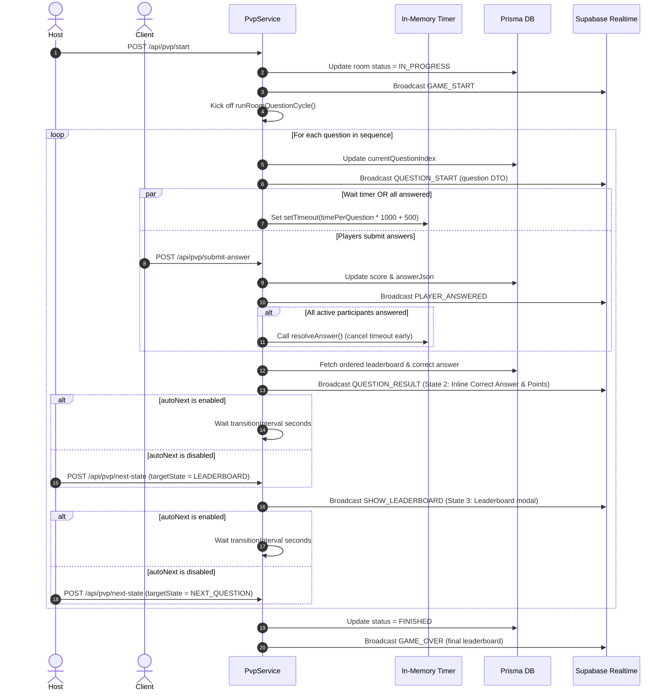

# Real-time PVP Competition Feature Documentation

**Current Version:** 2.4  
**Module Location:**
- Backend Routes: [pvpRoutes.ts](file:///e:/history-app/apps/express-server/src/routes/pvpRoutes.ts)
- Backend Controllers: [pvpController.ts](file:///e:/history-app/apps/express-server/src/controllers/pvpController.ts)
- Backend Services: [pvpService.ts](file:///e:/history-app/apps/express-server/src/services/pvpService.ts)
- Backend Types: [pvpTypes.ts](file:///e:/history-app/apps/express-server/src/types/pvpTypes.ts)
- Frontend Feature: [pvp](file:///e:/history-app/apps/react-native-client/src/features/pvp)
  - Screens: [PvpMainScreen.tsx](file:///e:/history-app/apps/react-native-client/src/features/pvp/screens/PvpMainScreen.tsx), [PvpGameScreen.tsx](file:///e:/history-app/apps/react-native-client/src/features/pvp/screens/PvpGameScreen.tsx)
  - Components: [CreateRoomTab.tsx](file:///e:/history-app/apps/react-native-client/src/features/pvp/components/CreateRoomTab.tsx), [JoinRoomTab.tsx](file:///e:/history-app/apps/react-native-client/src/features/pvp/components/JoinRoomTab.tsx), [PvpLobbyView.tsx](file:///e:/history-app/apps/react-native-client/src/features/pvp/components/PvpLobbyView.tsx)
  - Hooks: [usePvpRealtime.ts](file:///e:/history-app/apps/react-native-client/src/features/pvp/hooks/usePvpRealtime.ts)
  - Services & API: [pvpApi.ts](file:///e:/history-app/apps/react-native-client/src/features/pvp/services/pvpApi.ts)
  - Types: [types.ts](file:///e:/history-app/apps/react-native-client/src/features/pvp/types.ts)
- Database Schema: [schema.prisma](file:///e:/history-app/packages/shared/prisma/schema.prisma)

---

## 1. Feature Overview

The PVP (Player vs Player) Competition system provides real-time synchronous multiplayer quiz battles for up to 8 participants per room.

### Core Key Capabilities
- **Room Creation & Configuration:** Host selects question count (5, 10, 15) and time limit per question (10s, 15s, 30s). Questions can be generated from specific test presets (`testId`) or auto-picked based on scope.
- **Unique 4-Digit Room Codes:** Non-conflicting short numeric codes generated for room entry.
- **Real-time Synchronized Gameplay:** Server-driven game loop using Supabase Admin WebSockets (`pvp_{roomCode}`) for broadcast events.
- **Dynamic Speed Bonus Scoring:** Score rewards both correctness and answer speed (up to 2x multiplier for immediate responses).
- **Auto-Advancing Timer Cycle:** Server manages per-question duration and automatically resolves early if all room participants answer before timeout.
- **Live Leaderboard & Inter-Question Animations:** Real-time point gain notifications, mascot feedback, and final game standings.

---

## 2. Architecture & File Structure

```
history-app/
├── apps/express-server/src/
│   ├── controllers/
│   │   └── pvpController.ts       # Route handlers (create, join, info, start, submit)
│   ├── routes/
│   │   └── pvpRoutes.ts           # Express router for /api/pvp/*
│   ├── services/
│   │   └── pvpService.ts          # Core PVP engine, room lifecycle & timer loop
│   └── types/
│       └── pvpTypes.ts            # Backend DTO contracts
├── apps/react-native-client/src/features/pvp/
│   ├── components/
│   │   ├── CreateRoomTab.tsx      # Room creation form component
│   │   ├── JoinRoomTab.tsx        # 4-digit code room join input component
│   │   └── PvpLobbyView.tsx       # Pre-game lobby view displaying player cards
│   ├── hooks/
│   │   └── usePvpRealtime.ts      # Custom hook managing Supabase Realtime channel
│   ├── screens/
│   │   ├── PvpMainScreen.tsx      # Main tab/lobby container screen
│   │   └── PvpGameScreen.tsx      # Full-screen active game view with live timer
│   ├── services/
│   │   └── pvpApi.ts              # RTK Query API slice for PVP HTTP endpoints
│   ├── types.ts                   # Frontend TypeScript types
│   └── index.ts                   # Module barrel export
└── packages/shared/prisma/
    └── schema.prisma              # PvpRoom & PvpParticipant data models
```

---

## 3. Data Models & Database Schemas

### Prisma Models ([schema.prisma](file:///e:/history-app/packages/shared/prisma/schema.prisma#L793-L832))

#### `PvpRoom`
- `id` (`String @id @default(uuid())`): Internal room UUID.
- `code` (`String`): 4-digit public room code (indexed via `@@index([code, status])`). Code uniqueness is enforced only across active rooms (`LOBBY`, `IN_PROGRESS`), enabling past `FINISHED` or `CANCELLED` rooms to have their codes safely reused.
- `hostUserId` (`String`): User ID of room creator.
- `status` (`PvpRoomStatus`): Status enum (`LOBBY`, `IN_PROGRESS`, `FINISHED`, `CANCELLED`).
- `questionCount` (`Int`): Total questions in room (default `10`).
- `timePerQuestion` (`Int`): Seconds allowed per question (default `15`).
- `questionSequenceJson` (`Json`): Ordered array of question IDs `[number]`.
- `currentQuestionIndex` (`Int`): Active question index (0-indexed).
- `isPublic` (`Boolean @default(true)`): Room visibility mode (public vs private).

#### `PvpParticipant`
- `id` (`String @id @default(uuid())`): Participant entry ID.
- `roomId` (`String`): Foreign key to `PvpRoom`.
- `userId` (`String`): Foreign key to `User`.
- `score` (`Float`): Total cumulative score in room (default `0`).
- `answersJson` (`Json`): Array of submitted answer records `[{ questionIndex, questionId, userAnswer, scoreEarned, timeTakenSeconds }]`.

---

## 4. API Endpoints & Request/Response Contracts

### HTTP REST Endpoints ([pvpRoutes.ts](file:///e:/history-app/apps/express-server/src/routes/pvpRoutes.ts))

#### 1. `POST /api/pvp/create`
Creates a new room with host as first participant.
- **Request Body (`CreatePvpRoomRequest`):**
  ```json
  {
    "questionCount": 10,
    "timePerQuestion": 15,
    "testId": "optional-test-uuid",
    "scopeType": "LESSON",
    "scopeId": 12,
    "isPublic": true
  }
  ```
- **Response (`PvpRoomDto`):** Room details including 4-digit code and initial ordered question list.

#### 2. `POST /api/pvp/join`
Joins an existing room in `LOBBY` status. Maximum 8 participants.
- **Request Body (`JoinPvpRoomRequest`):**
  ```json
  { "roomCode": "1234" }
  ```
- **Response (`PvpRoomDto`):** Updated room object. Also triggers `PLAYER_JOINED` broadcast event.

#### 3. `GET /api/pvp/room/:code`
Fetches room details by code.

#### 4. `POST /api/pvp/start`
Host-only action to start the match.
- **Request Body:** `{ "roomCode": "1234" }`
- **Behavior:** Updates status to `IN_PROGRESS`, broadcasts `GAME_START`, and starts `runRoomQuestionCycle` loop.

#### 5. `POST /api/pvp/submit-answer`
Submits player answer for current question.
- **Request Body (`SubmitPvpAnswerRequest`):**
  ```json
  {
    "roomCode": "1234",
    "questionIndex": 0,
    "userAnswer": { "selectedOptions": [1] },
    "timeTakenSeconds": 4
  }
  ```
- **Response:** `{ "scoreEarned": 560, "totalScore": 560 }`
- **Behavior:** Calculates score, updates participant record, broadcasts `PLAYER_ANSWERED`. If all participants have answered, cancels active question timer early.

#### 6. `GET /api/pvp/curated-tests`
Fetches list of available preset tests for room host selection.
- **Response:** `Array<{ id: string, title: string, summary: string | null, questionCount: number }>`

#### 7. `GET /api/pvp/available-questions-count`
Calculates available active question count for a selected scope or curated test.
- **Query Params:** `scopeType`, `scopeId`, `testId`
- **Response:** `{ "availableCount": 24 }`

#### 8. `GET /api/pvp/public-rooms`
Fetches active public rooms in `LOBBY` status, excluding rooms created by or joined by current user.
- **Response (`PvpPublicRoomDto[]`):** `Array<{ id, code, hostUserId, hostName, hostAvatar, questionCount, timePerQuestion, participantCount, maxParticipants, createdAt }>`

---

## 5. Real-time Supabase Broadcast Channel Protocol

- **Channel Identifier:** `pvp_${roomCode}`
- **Client Handler:** [usePvpRealtime.ts](file:///e:/history-app/apps/react-native-client/src/features/pvp/hooks/usePvpRealtime.ts)

### Broadcast Events

| Event Name | Trigger | Payload Contents |
| :--- | :--- | :--- |
| `PLAYER_JOINED` | Participant joins lobby | `{ participants: PvpParticipantDto[] }` |
| `GAME_START` | Host starts game | `{ roomCode: string, questionCount: number }` |
| `QUESTION_START` | Server moves to question | `{ questionIndex, totalQuestions, timeLimitSeconds, question: QuestionV2Dto }` |
| `PLAYER_ANSWERED` | Participant submits answer | `{ userId: string, questionIndex: number }` |
| `QUESTION_RESULT` | Question timer ends / all answered | `{ questionIndex, correctAnswerData, explanation, leaderboard: PvpParticipantDto[] }` |
| `GAME_OVER` | All questions finished | `{ leaderboard: PvpLeaderboardEntry[] }` |

---

## 6. Scoring System & Speed Bonus Calculation

Evaluated in [pvpService.ts](file:///e:/history-app/apps/express-server/src/services/pvpService.ts) using the shared [scoreEngine.ts](file:///e:/history-app/apps/express-server/src/services/scoreEngine.ts) from `test_v2`:

1. **Parity with Test V2 Evaluation:**
   - **CHOOSE Single:** `maxScore = 0.25` → Exact match yields `0.25`. Base score = $0.25 \times 400 = 100$ pts.
   - **CHOOSE Multi:** `maxScore = Math.max(0.25, Math.floor(N / 2) * 0.25)`. Partial credit awarded per correct option, deducted per wrong option. Base score = $\text{scoreAwarded} \times 400$.
   - **FILL:** `maxScore = 0.5` → Text normalized (case-insensitive, punctuation stripped), digit exact match enforced, Levenshtein distance typo tolerance. Exact match yields `0.5`. Base score = $0.5 \times 400 = 200$ pts.
   - **MATCH:** `maxScore = Math.max(0.25, Math.floor(P / 2) * 0.25)`. All left-right pairs must match correctly. Base score = $\text{scoreAwarded} \times 400$.
2. **Base Score Formula:**
   $$\text{baseScore} = \text{scoreAwarded} \times 400$$
3. **Speed Multiplier Formula:**
   $$\text{speedBonus} = 1 + \frac{\max(0, \text{timePerQuestion} - \text{timeTakenSeconds})}{\text{timePerQuestion}}$$
4. **Total Points Earned:**
   $$\text{scoreEarned} = \text{Math.round}(\text{baseScore} \times \text{speedBonus})$$
   *(Example: Single choice answered instantly yields $100 \times 2.0 = 200$ pts; Fill answered instantly yields $200 \times 2.0 = 400$ pts)*.

---

## 7. Game Timer Cycle Lifecycle

Managed asynchronously in [pvpService.ts](file:///e:/history-app/apps/express-server/src/services/pvpService.ts#L346-L444):



---

## 8. Frontend User Experience & Components

1. **[PvpMainScreen.tsx](file:///e:/history-app/apps/react-native-client/src/features/pvp/screens/PvpMainScreen.tsx):** Root feature entry point. Manages active tab state (`create` / `join`), room join/create handlers, and conditionally renders `PvpLobbyView` or full-screen `PvpGameScreen`.
2. **[CreateRoomTab.tsx](file:///e:/history-app/apps/react-native-client/src/features/pvp/components/CreateRoomTab.tsx):** Pill selection UI for question count (5, 10, 15) and time limit (10s, 15s, 30s).
3. **[JoinRoomTab.tsx](file:///e:/history-app/apps/react-native-client/src/features/pvp/components/JoinRoomTab.tsx):** 4-digit code input field with auto-submit validation.
4. **[PvpLobbyView.tsx](file:///e:/history-app/apps/react-native-client/src/features/pvp/components/PvpLobbyView.tsx):** Lobby screen displaying 4-digit room code badge, participant list (up to 8), host "Start Match" button, and non-host waiting indicator.
5. **[PvpGameScreen.tsx](file:///e:/history-app/apps/react-native-client/src/features/pvp/screens/PvpGameScreen.tsx):**
   - Animated top countdown bar using Reanimated `withTiming`.
   - Question components reuse: `ChooseQuestion`, `FillQuestion`, `MatchQuestion`.
   - Inter-question result modal featuring `PracticeFeedbackMascot`, point gain badges (`+560 điểm!`), and rank updates.
   - Final game-over victory/ranking screen with exit options.

---

## 9. Known Issues & Remediation Strategy

### Issue 1 (Small): Host can start room with 1 player
- **Status:** FIXED
- **Existence:** Confirmed.
- **Root Cause:** Neither `PvpLobbyView.tsx` nor backend `startRoom` in `pvpService.ts` checks if `participants.length >= 2`.
- **Remediation:** Enforce `participants.length >= 2` validation in backend `startRoom` service and disable host "Start" button on FE with descriptive helper message when single player.

### Issue 2 (Small): Result modal does not display correct answer
- **Status:** FIXED
- **Existence:** Confirmed.
- **Root Cause:** Backend sends `correctAnswerData` in `QUESTION_RESULT` broadcast payload, but `PvpGameScreen.tsx` inter-question result modal (`<Modal visible={!!questionResult}>`) only renders explanation text and ignores `correctAnswerData`.
- **Remediation:** Render a formatted "Đáp án đúng" preview section inside the result modal for `CHOOSE`, `FILL`, and `MATCH` question types.

### Issue 3 (Big): No re-join flow if player leaves app/screen
- **Status:** FIXED
- **Existence:** Confirmed.
- **Root Cause:** Room state (`currentRoom`) is stored solely in local React `useState` of `PvpMainScreen.tsx`. Back navigation unmounts the component and clears room state. No active session recovery API exists.
- **Remediation:**
  1. Add `GET /api/pvp/active-room` backend endpoint returning user's active `LOBBY` or `IN_PROGRESS` room.
  2. Call active room recovery on FE `PvpMainScreen` mount and restore lobby/game session automatically.

### Issue 4 (Big): Old players appear in newly created rooms after game finish
- **Status:** FIXED
- **Existence:** Confirmed.
- **Root Cause:** `usePvpRealtime.ts` initializes `participants` state once with `useState(initialParticipants)`. Calling `resetState()` on game finish does not clear `participants` (`setParticipants([])`), nor does the hook re-sync `participants` when a new room is set. `PvpMainScreen.tsx` falls back to `participants.length > 0 ? participants : currentRoom.participants`, displaying leftover players.
- **Remediation:**
  1. Update `resetState()` in `usePvpRealtime.ts` to call `setParticipants([])`.
  2. Add `useEffect` in `usePvpRealtime.ts` to sync `setParticipants(initialParticipants)` whenever `roomCode` or `initialParticipants` changes.

---

## 10. Version Log

### Version 2.1

#### 1. 4-State Game Loop Progression Flow
- **State 1 (Answering):** Active question widgets (`CHOOSE`, `FILL`, `MATCH`).
- **State 2 (Inline Results):** Correct answer options, explanation, and mascot score gain rendered directly on screen body inside [PvpGameScreen.tsx](file:///e:/history-app/apps/react-native-client/src/features/pvp/screens/PvpGameScreen.tsx). Question controls disabled.
- **State 3 (Leaderboard Modal):** Broadcast `SHOW_LEADERBOARD` triggers modal standings overlay (answer details omitted).
- **State 4 (Next Question):** Advance `currentQuestionIndex` or end match.

#### 2. Transition Mode Control (`autoNext` & `transitionInterval`)
- Added `autoNext` (Boolean) and `transitionInterval` (Int) fields to `PvpRoom` model in [schema.prisma](file:///e:/history-app/packages/shared/prisma/schema.prisma).
- Added room creation settings in [CreateRoomTab.tsx](file:///e:/history-app/apps/react-native-client/src/features/pvp/components/CreateRoomTab.tsx).
- Added `POST /api/pvp/next-state` endpoint in [pvpRoutes.ts](file:///e:/history-app/apps/express-server/src/routes/pvpRoutes.ts) allowing room host to manually advance from State 2 → 3 → 4 when `autoNext = false`.

#### 3. Leaderboard Placement Differences
- Calculated rank deltas (`prevRank - currentRank`) in [usePvpRealtime.ts](file:///e:/history-app/apps/react-native-client/src/features/pvp/hooks/usePvpRealtime.ts).
- Rendered green `+N` and red `-N` rank badges next to participant ranks inside leaderboard modal.

#### 4. Test V2 Scoring Parity & Partial Credit Support
- Aligned PVP answer evaluation in `submitAnswer` with `scoreEngine.ts`.
- Used `evalRes.scoreAwarded * 400` as base score to preserve partial credit, multiplied by speed bonus ($1.0\times - 2.0\times$). 

### Version 2.2

#### 1. Curated Tests vs Auto-Pick Question Selection
- Added support for selecting curated preset tests (`testId`) or auto-picking questions based on scope (`scopeType` & `scopeId`) in [CreateRoomTab.tsx](file:///e:/history-app/apps/react-native-client/src/features/pvp/components/CreateRoomTab.tsx).
- Added `GET /api/pvp/curated-tests` endpoint.

#### 2. Cascading Scope Selection
- Added scope level selection (`NATIONAL`, `GRADE`, `TOPIC`, `LESSON`, `SECTION`, `NODE`) with dynamic cascading dropdown pickers using content hierarchy APIs.

#### 3. Available Question Count Preview & Validation
- Added `GET /api/pvp/available-questions-count` endpoint.
- Displayed real-time available question count badge on frontend.
- Constrained selected question count to not exceed total available pool size.

#### 4. Custom Numeric Question Input
- Added numeric `TextInput` allowing users to type custom question counts alongside shortcut pills.

#### 5. Room Privacy Settings (Public vs Private)
- Added `isPublic` (`Boolean`, default `true`) column to `PvpRoom` model in [schema.prisma](file:///e:/history-app/packages/shared/prisma/schema.prisma).
- Added 2 toggle pill buttons ("Công khai" / "Riêng tư") at top of room creation screen right below screen title in [CreateRoomTab.tsx](file:///e:/history-app/apps/react-native-client/src/features/pvp/components/CreateRoomTab.tsx).

#### 6. Public Room Discovery & Excluded Own Rooms
- Added `GET /api/pvp/public-rooms` endpoint in [pvpRoutes.ts](file:///e:/history-app/apps/express-server/src/routes/pvpRoutes.ts) and [pvpService.ts](file:///e:/history-app/apps/express-server/src/services/pvpService.ts), querying rooms with `isPublic = true`, `status = LOBBY`, `hostUserId != userId`, and `participants` not containing current user.
- Integrated public room list into [JoinRoomTab.tsx](file:///e:/history-app/apps/react-native-client/src/features/pvp/components/JoinRoomTab.tsx) with pull-to-refresh, room code badges, host info, participant counts (`X/8`), and direct join actions while retaining manual 4-digit code entry.

#### 7. Host Transfer & Room Cleanup on Participant Leave
- **Host Transfer:** When room host leaves and participants remain, [pvpService.ts](file:///e:/history-app/apps/express-server/src/services/pvpService.ts) automatically reassigns `hostUserId` to the next participant (`remainingParticipants[0].userId`) and broadcasts `hostUserId` in `PLAYER_JOINED` event. [PvpMainScreen.tsx](file:///e:/history-app/apps/react-native-client/src/features/pvp/screens/PvpMainScreen.tsx) dynamically updates UI controls for the new host.
- **Room Cleanup:** When the last participant leaves, active question timers are cleared and room status is set to `CANCELLED`.

#### 8. Question Count Clamping & Toast Validation
- Clamped numeric question input in [CreateRoomTab.tsx](file:///e:/history-app/apps/react-native-client/src/features/pvp/components/CreateRoomTab.tsx) to strictly positive values (`> 0`).
- Prevented room creation and displayed error toast via `toastService.show` if `questionCount > availableCount`.

### Version 2.3

#### 1. Reusable Room Codes for Finished/Cancelled Rooms
- Removed `@unique` constraint from `code` column on `PvpRoom` model in [schema.prisma](file:///e:/history-app/packages/shared/prisma/schema.prisma) and added index `@@index([code, status])`.
- Updated code generation (`generate4DigitCode`) and active room lookups in [pvpService.ts](file:///e:/history-app/apps/express-server/src/services/pvpService.ts) to check uniqueness only against active rooms (`LOBBY`, `IN_PROGRESS`).

#### 2. Strict Active Room Scoping for Join & Room Queries
- Scope room lookup in `joinRoom`, `getRoomInfo`, `startRoom`, and `triggerNextState` in [pvpService.ts](file:///e:/history-app/apps/express-server/src/services/pvpService.ts) to active statuses (`LOBBY` / `IN_PROGRESS`) ordered by `createdAt desc`.
- Prohibits new players from joining `IN_PROGRESS` rooms by code (throws `ROOM_NOT_LOBBY`), while allowing existing participants to re-enter.

#### 3. In-App Re-entry Section on PVP Main Screen
- Added active room banner section to [PvpMainScreen.tsx](file:///e:/history-app/apps/react-native-client/src/features/pvp/screens/PvpMainScreen.tsx) when user leaves an active room midway.
- Displays room code, active status badge (`Phòng chờ` / `Đang thi đấu`), and quick actions ("Quay lại phòng" / "Rời phòng").

#### 4. On-App-Start Active Room Check & Modal Prompt
- Created dedicated component [PvpActiveRoomPromptModal.tsx](file:///e:/history-app/apps/react-native-client/src/features/pvp/components/PvpActiveRoomPromptModal.tsx) mounted in global layout [_layout.tsx](file:///e:/history-app/apps/react-native-client/src/app/_layout.tsx).
- Automatically prompts logged-in users once on app launch if an active room session is detected, allowing one-tap navigation back to the match or leaving the room.

#### 5. Direct `IN_PROGRESS` Match Re-entry & Sub-state Restoration
- Updated [usePvpRealtime.ts](file:///e:/history-app/apps/react-native-client/src/features/pvp/hooks/usePvpRealtime.ts) and [PvpMainScreen.tsx](file:///e:/history-app/apps/react-native-client/src/features/pvp/screens/PvpMainScreen.tsx) to initialize `isGameStarted = true`, `currentQuestionIndex`, and `currentQuestion` directly when `room.status === "IN_PROGRESS"`.
- Resuming an `IN_PROGRESS` room bypasses `PvpLobbyView` entirely and opens `PvpGameScreen` straight at the active question, eliminating lobby stuck issues and `ALREADY_STARTED` errors.

#### 6. Soft-Leave Answer Skipping & Host Progression Controls
- **Realtime Presence Sync**: [usePvpRealtime.ts](file:///e:/history-app/apps/react-native-client/src/features/pvp/hooks/usePvpRealtime.ts) tracks active connected user IDs (`onlineUserIds`) via Supabase Realtime presence and passes them with answer submissions in [PvpGameScreen.tsx](file:///e:/history-app/apps/react-native-client/src/features/pvp/screens/PvpGameScreen.tsx).
- **Backend Early Resolution**: [pvpService.ts](file:///e:/history-app/apps/express-server/src/services/pvpService.ts) filters `allSubmitted` check to currently connected online participants, resolving question timers immediately when all online players answer.
- **Online Host Indefinite Pause**: When `autoNext = false` and host is online, NO fallback timer runs, holding inter-question screens indefinitely for lectures/events until the host taps "Tiếp tục".
- **Host Soft-Leave Fallback**: If the host soft-leaves (offline), a 5s fallback timer triggers to prevent room freezes.
- **Host Manual Override**: Host can tap "Tiếp tục" at any time regardless of `autoNext` mode to skip the remaining `transitionInterval` timer countdown immediately.

#### 8. Back Button Navigation & Exit Confirmation Upgrade
- **Top Bar Back Button**: Added `onBackPress` handlers to `branchConfig` in both [PvpMainScreen.tsx](file:///e:/history-app/apps/react-native-client/src/features/pvp/screens/PvpMainScreen.tsx) and [PvpGameScreen.tsx](file:///e:/history-app/apps/react-native-client/src/features/pvp/screens/PvpGameScreen.tsx) to ensure the top bar back button executes expected navigation across main tabs, lobby, and active game screens.
- **In-Progress Hardware Back Interception**: Intercepted hardware back button presses (`BackHandler`) during active `IN_PROGRESS` gameplay in [PvpGameScreen.tsx](file:///e:/history-app/apps/react-native-client/src/features/pvp/screens/PvpGameScreen.tsx). Pressing the phone's back button triggers the exit modal confirmation instead of executing an unconfirmed soft-leave.

#### 9. In-Place Answer Option Marking & Floating Explanation Drawer
- **In-Place Option Marking**: Replaced bottom text correct answer previews with in-place option status marking using `test_v2` question components (`ChooseQuestion`, `FillQuestion`, `MatchQuestion`) in [PvpGameScreen.tsx](file:///e:/history-app/apps/react-native-client/src/features/pvp/screens/PvpGameScreen.tsx):
  - **Selected & Correct**: Green background/border with check mark icon and score badge (`+points`).
  - **Selected & Wrong**: Red background/border with X icon and score badge (`-points` or `+0đ`).

### Version 2.4

#### 1. PVP 400x Score Scale Feedback Alignment
- Added optional `scoreMultiplier?: number` prop (default `1`) to `test_v2` question components ([ChooseQuestion.tsx](file:///e:/history-app/apps/react-native-client/src/features/test_v2/components/ChooseQuestion.tsx), [FillQuestion.tsx](file:///e:/history-app/apps/react-native-client/src/features/test_v2/components/FillQuestion.tsx), [MatchQuestion.tsx](file:///e:/history-app/apps/react-native-client/src/features/test_v2/components/MatchQuestion.tsx)).
- Passed `scoreMultiplier={400}` from [PvpGameScreen.tsx](file:///e:/history-app/apps/react-native-client/src/features/pvp/screens/PvpGameScreen.tsx) to render PVP scaled score badges (`+100đ`, `+67đ`, `+200đ`) instead of test-v2 decimal test scores (`+0.25đ`, `+0.17đ`).

#### 2. Timeout Answer Submission & Server Race Condition Fix
- Added 400ms server grace period buffer in [pvpService.ts](file:///e:/history-app/apps/express-server/src/services/pvpService.ts) after question timer expiration before querying DB for `QUESTION_RESULT` leaderboard broadcast.
- Updated FE auto-submit trigger in [PvpGameScreen.tsx](file:///e:/history-app/apps/react-native-client/src/features/pvp/screens/PvpGameScreen.tsx) to fire at `<=` 1s remaining.
- Fixed result feedback correctness calculation in [PvpGameScreen.tsx](file:///e:/history-app/apps/react-native-client/src/features/pvp/screens/PvpGameScreen.tsx) using `evalResult ? evalResult.isCorrect : (myPointGain > 0)` to guarantee mascot drawer title aligns with option green/red marking.

#### 3. Stale Question Result State Leakage Fix
- Fixed issue where leftover `questionResult` state (from initial room load or previous question result) leaked into active question state during gameplay.
- Added `activeQuestionResult` memo in [PvpGameScreen.tsx](file:///e:/history-app/apps/react-native-client/src/features/pvp/screens/PvpGameScreen.tsx) filtering `questionResult` by `questionIndex === currentQuestionIndex`.
- Added `questionIndex` filtering and state reset guard in [usePvpRealtime.ts](file:///e:/history-app/apps/react-native-client/src/features/pvp/hooks/usePvpRealtime.ts) so previous question correct answer data is cleared when moving to the next question, preventing random options from rendering in dashed "missed" style during active question answering.

---

### Detailed Test Cases (v2.3)

| Test Case ID | Scenario | Steps | Expected Result | Status |
| :--- | :--- | :--- | :--- | :--- |
| **TC-PVP-2301** | Soft-leave during question & reconnect at Result/Leaderboard | 1. Player A & B start match (Q4).<br>2. Player A soft-leaves (closes app) on Q4.<br>3. Q4 ends on server; room moves to Result/Leaderboard.<br>4. Player A re-opens app and taps "Quay lại phòng". | Player A lands directly on Q4 Result overlay / Leaderboard modal. Player A cannot answer expired Q4 options and does not get stuck. When Q5 starts, Player A smoothly transitions to Q5 with Player B. | Untested |
| **TC-PVP-2302** | Soft-leave during question answering (Early skip) | 1. Player A & B enter Q3.<br>2. Player A soft-leaves.<br>3. Player B selects answer and submits. | Server detects Player A is offline via Realtime presence. Q3 finishes immediately upon Player B's answer without waiting out the full 15s timer. | Untested |
| **TC-PVP-2303** | Host soft-leave during manual transition mode (`autoNext = false`) | 1. Host A creates room with `autoNext = false`.<br>2. Q2 finishes, moving to Result phase.<br>3. Host A soft-leaves (closes app). | Server detects Host A is offline and triggers a 5s fallback timer to advance to Leaderboard / Next Question, preventing remaining players from freezing. | Untested |
| **TC-PVP-2304** | Online host pause in manual mode (`autoNext = false`) | 1. Host A & Player B enter Q2 Result phase.<br>2. Host A stays online without tapping "Tiếp tục". | Screen remains paused on Result / Leaderboard indefinitely. No fallback timer fires while host is online. Host A tapping "Tiếp tục" immediately advances to next state. | Untested |
| **TC-PVP-2305** | Host manual override during `autoNext = true` mode | 1. Room starts with `autoNext = true` (15s interval).<br>2. Q1 finishes, displaying 15s auto-next countdown.<br>3. Host A taps "Tiếp tục". | Server cancels the remaining 15s interval timer and advances immediately to the next question state. | Untested |
| **TC-PVP-2306** | All players soft-leave midway (Abandonment) | 1. Player A & B are in match (Q2).<br>2. Both players soft-leave (close app). | Room advances through remaining questions using 5s fallbacks for transitions until it reaches `FINISHED` state. Reconnecting later lets players rejoin at the current active question index. | Untested |
| **TC-PVP-2307** | Host soft-leaves in Lobby | 1. Host A creates lobby.<br>2. Player B joins lobby.<br>3. Host A soft-leaves (closes app) without starting or hard-leaving. | Lobby stays active. Player B remains in lobby. Host A re-opens app, is prompted to return, and resumes host duties with "Start Match" enabled. | Untested |
| **TC-PVP-2308** | Player soft-leaves in Lobby & Host starts match | 1. Player B joins lobby.<br>2. Player B soft-leaves.<br>3. Host A starts match. | Match transitions to `IN_PROGRESS`. Host A plays Q1 (finishes early since Player B is offline). Player B can reconnect directly into active gameplay. | Untested |
| **TC-PVP-2309** | Reconnect within the same question timer | 1. Host A & Player B enter Q3.<br>2. Player B soft-leaves 3s into question.<br>3. Player B reconnects 8s into question. | Player B lands on active question screen with remaining time (~7s) ticking down, allowing them to answer before expiration. | Untested |
| **TC-PVP-2310** | Reconnect skip transition states | 1. Player B soft-leaves at Q2 Result screen.<br>2. Host A taps "Tiếp tục" to advance to Leaderboard modal.<br>3. Player B reconnects. | Player B lands directly on Leaderboard modal UI state. | Untested |
| **TC-PVP-2311** | Soft-leave on final question result | 1. Room reaches Q10 Result phase.<br>2. Player B soft-leaves.<br>3. Host A advances to game finished screen. | Room status changes to `FINISHED`. Player B re-opening app is not prompted for active room since match is complete. Final standings are preserved in database. | Untested |
| **TC-PVP-2312** | Host manual transition override vs fallback race | 1. Host A soft-leaves in manual mode (`autoNext = false`).<br>2. Server starts 5s fallback timer.<br>3. Host A reconnects and taps "Tiếp tục" at 4.8s. | `triggerNextState` cancels fallback timer and advances room exactly once to next state. | Untested |
| **TC-PVP-2313** | Back button handling during match | 1. Player A is in an `IN_PROGRESS` PVP match.<br>2. Player A taps the top bar back button or phone's hardware back button. | Exit confirmation modal opens ("Rời khỏi phòng thi đấu?") instead of soft-leaving the room directly. Tapping "Ở lại" closes modal and resumes game; tapping "Rời phòng" leaves room. | Untested |
