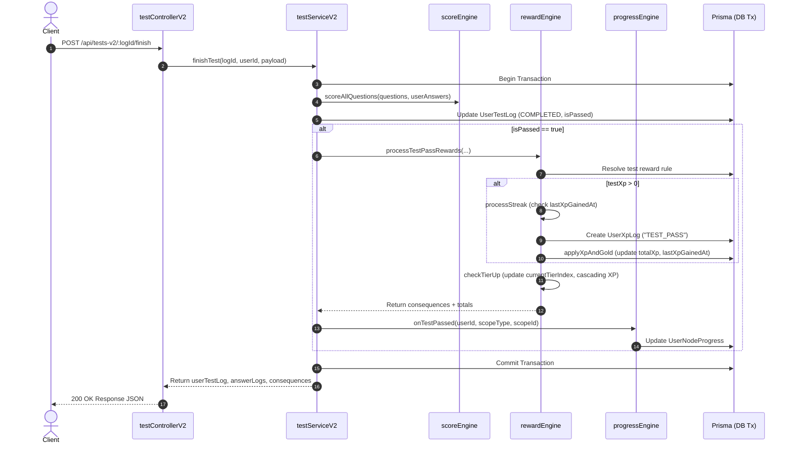

# Test System V2 Documentation

**Current Version:** 2.1  
**Module Location:**
- Backend Routes: [testRoutesV2.ts](../../apps/express-server/src/routes/testRoutesV2.ts), [gamificationRoutes.ts](../../apps/express-server/src/routes/gamificationRoutes.ts), [socialRoutes.ts](../../apps/express-server/src/routes/socialRoutes.ts)
- Backend Controllers: [testControllerV2.ts](../../apps/express-server/src/controllers/testControllerV2.ts), [contentController.ts](../../apps/express-server/src/controllers/contentController.ts), [authController.ts](../../apps/express-server/src/controllers/authController.ts), [gamificationController.ts](../../apps/express-server/src/controllers/gamificationController.ts), [socialController.ts](../../apps/express-server/src/controllers/socialController.ts)
- Backend Services: [testServiceV2.ts](../../apps/express-server/src/services/testServiceV2.ts), [scoreEngine.ts](../../apps/express-server/src/services/scoreEngine.ts), [progressEngine.ts](../../apps/express-server/src/services/progressEngine.ts), [rewardEngine.ts](../../apps/express-server/src/services/rewardEngine.ts), [shopService.ts](../../apps/express-server/src/services/shopService.ts), [gamificationService.ts](../../apps/express-server/src/services/gamificationService.ts), [socialService.ts](../../apps/express-server/src/services/socialService.ts)
- Backend Types: [testV2Types.ts](../../apps/express-server/src/types/testV2Types.ts), [progressTypes.ts](../../apps/express-server/src/types/progressTypes.ts)
- Frontend Feature: [features/test_v2](../../apps/react-native-client/src/features/test_v2), [features/streak](../../apps/react-native-client/src/features/streak), [features/social](../../apps/react-native-client/src/features/social)
  - Components: [TestContainer.tsx](../../apps/react-native-client/src/features/test_v2/components/TestContainer.tsx), [TestIntro.tsx](../../apps/react-native-client/src/features/test_v2/components/TestIntro.tsx), [StreakDrawerModal.tsx](../../apps/react-native-client/src/features/streak/components/StreakDrawerModal.tsx), [MonthlyStreakModal.tsx](../../apps/react-native-client/src/features/streak/components/MonthlyStreakModal.tsx), [XpComparisonChart.tsx](../../apps/react-native-client/src/features/streak/components/XpComparisonChart.tsx)
  - Hooks: [useTestRunner.ts](../../apps/react-native-client/src/features/test_v2/hooks/useTestRunner.ts)
  - Services & Store: [testApi.ts](../../apps/react-native-client/src/features/test_v2/services/testApi.ts), [streakApi.ts](../../apps/react-native-client/src/features/streak/services/streakApi.ts), [socialApi.ts](../../apps/react-native-client/src/features/social/services/socialApi.ts)
  - Screens: [TestHistoryScreen.tsx](../../apps/react-native-client/src/features/test_v2/screens/TestHistoryScreen.tsx), [OtherProfileScreen.tsx](../../apps/react-native-client/src/features/social/screens/OtherProfileScreen.tsx)
- Database Schema: [schema.prisma](../../packages/shared/prisma/schema.prisma)

---

## Version Log

| Version | Key Changes |
| :--- | :--- |
| **v1.0** | Initial practice and exam test engine, score engine, question auto-picking strategies (`BALANCED`, `LOW_MASTERY`, `WRONG`), dynamic scope expansion. |
| **v2.0** | Integrated `progressEngine` (node completion tracking), `rewardEngine` (dynamic `RewardRule` resolution), streak milestone rewards, and cascading tier rank upgrades. |
| **v2.1** | **XP-Triggered Streaks:** Streak maintenance gated on earning $> 0$ XP on a UTC day instead of test-pass count. <br>**User XP Audit Logging:** Introduced `UserXpLog` model tracking every XP gain and source (`TEST_PASS`, `TIER_REACHED`, `STREAK_MILESTONE`, etc.). <br>**Weighted Heat-Map Calendar:** 1-week and monthly (`MonthlyStreakModal`) heat-map calendar UI showing fire brightness based on daily XP gained. <br>**User XP Comparison Graph:** Dual-line SVG chart (`XpComparisonChart`) on user profiles comparing XP progress across 3-Day, Week, Month, Year, and All-Time ranges (clamped to earliest `UserXpLog`). |

---

## 1. Feature Overview

The Test System V2 is a unified testing engine supporting both **PRACTICE** (immediate feedback per question, optional retry) and **EXAM** (timed test, nav grid, bulk submission) modes across multiple granular scopes (`GRADE`, `TOPIC`, `LESSON`, `SECTION`, `NODE`, `NATIONAL`).

### Core Design Principles
- **Unified Engine:** Single API surface (`/api/tests-v2/*`) and shared question runner state machine for both exam and practice modes.
- **Dynamic Scope Expansion:** Automated question pool expansion down/up entity hierarchies.
- **Smart Question Selection:** Support for algorithmic auto-picking strategies (`BALANCED`, `LOW_MASTERY`, `WRONG`) alongside manual/curated tests (`testId`).
- **Resumability & Draft Auto-Saving:** Active EXAM sessions auto-save draft responses every 3 seconds (debounced) and can be resumed if unexpired.
- **Client & Server Scoring Parity:** Deterministic grading rules executed on backend upon submission, and locally on frontend during Practice mode for instant sound/mascot feedback.
- **Question Mastery Tracking:** Individual user performance per question (`UserQuestionMastery`) updates level (0-5) and consecutive correct counts upon test finish.
- **Integrated Progress & Gamification Pipeline:** Test passing triggers progress updates (`progressEngine`), calculates XP/Gold/item rewards (`rewardEngine`), updates daily XP-triggered active streaks, and checks tier rank upgrades in a single database transaction.

---

## 2. Architecture & File Structure

```
history-app/
├── apps/express-server/src/
│   ├── controllers/
│   │   ├── authController.ts         # Handles login streak resets based on lastXpGainedAt
│   │   ├── contentController.ts      # Handles finishStudy node progress triggers
│   │   ├── gamificationController.ts # Handles leaderboard, tiers, streak info & monthly calendar APIs
│   │   ├── socialController.ts       # Handles social profile & user XP comparison APIs
│   │   └── testControllerV2.ts       # HTTP handlers for start, draft, finish, abandon, resumable, history, info
│   ├── routes/
│   │   ├── gamificationRoutes.ts     # /api/gamification endpoints
│   │   ├── socialRoutes.ts           # /api/social endpoints
│   │   └── testRoutesV2.ts           # /api/tests-v2 endpoints
│   ├── services/
│   │   ├── gamificationService.ts    # Gamification info, leaderboard, monthly calendar calculations
│   │   ├── progressEngine.ts         # Central engine for progress & node status mutations
│   │   ├── rewardEngine.ts           # Resolution engine for test rewards, streak milestones, and tier upgrades
│   │   ├── scoreEngine.ts            # Server-side question evaluation & scoring rules
│   │   ├── shopService.ts            # User active booster item effects & multipliers
│   │   ├── socialService.ts          # Social user profile & multi-range XP comparison data calculation
│   │   └── testServiceV2.ts          # Core service: scope expansion, auto-picking, draft sync, test finish transaction
│   └── types/
│       ├── progressTypes.ts          # ProgressEventType enum & ProgressConsequence payload interfaces
│       └── testV2Types.ts            # DTOs, request/response interfaces, answer data contracts
├── apps/react-native-client/src/
│   ├── features/
│   │   ├── social/
│   │   │   ├── screens/OtherProfileScreen.tsx # User profile screen featuring XpComparisonChart
│   │   │   └── services/socialApi.ts          # RTK Query API slice for social endpoints
│   │   ├── streak/
│   │   │   ├── components/
│   │   │   │   ├── MonthlyStreakModal.tsx     # Full month heat-map calendar modal
│   │   │   │   ├── StreakDrawerModal.tsx      # 1-week heat-map calendar & milestone drawer
│   │   │   │   └── XpComparisonChart.tsx      # Dual-line SVG chart for multi-range XP comparison
│   │   │   └── services/streakApi.ts          # RTK Query API slice for streak & calendar endpoints
│   │   └── test_v2/
│   │       ├── components/
│   │       │   ├── ChooseQuestion.tsx
│   │       │   ├── FillQuestion.tsx
│   │       │   ├── MatchQuestion.tsx
│   │       │   ├── TestContainer.tsx
│   │       │   └── TestIntro.tsx
│   │       ├── hooks/useTestRunner.ts
│   │       └── services/testApi.ts
└── packages/shared/prisma/
    └── schema.prisma                 # UserTestLog, UserAnswerLog, UserNodeProgress, UserXpLog, RewardRule, UserRewardLog, Tier, UserItem
```

---

## 3. Data Models & Database Schemas

### Main Database Tables

#### `UserTestLog`
Tracks an entire test session (attempt).
- `id` (`String @id @default(uuid())`)
- `userId` (`String`)
- `testId` (`String?`) - NULL for auto-picked tests
- `purposeType` (`PurposeType`: `EXAM` | `PRACTICE`)
- `status` (`TestStatusType`: `IN_PROGRESS` | `COMPLETED` | `EXPIRED` | `ABANDONED`)
- `score` (`Int`) - Percentage score (0-100)
- `scoreAwarded` (`Float`), `maxScore` (`Float`)
- `xpEarned` (`Int`), `goldEarned` (`Int`) - Test-specific rewards earned upon passing
- `isPassed` (`Boolean?`)
- `startedAt`, `submittedAt`, `expiresAt` (`DateTime?`)

#### `UserXpLog`
Audit log recording every experience point gain transaction.
- `id` (`String @id @default(uuid())`)
- `userId` (`String`)
- `amount` (`Int`) - Experience points gained in transaction
- `sourceType` (`String`) - Source category (e.g. `TEST_PASS`, `TIER_REACHED`, `STREAK_MILESTONE`, `PRACTICE`)
- `sourceId` (`String?`) - Optional reference ID (e.g. test log ID, tier index)
- `createdAt` (`DateTime @default(now())`)

#### `UserNodeProgress`
Tracks student progression on specific study nodes.
- `userId` (`String`), `nodeId` (`Int`) (Composite key)
- `studiedAt` (`DateTime?`) - Timestamp when user finished reading/watching node content
- `allTestPassedAt` (`DateTime?`) - Timestamp when user passed tests scoped to this node
- `nodeCompletedAt` (`DateTime?`) - Timestamp when node was marked complete

#### `User` (Gamification & Streak Fields)
- `totalXp` (`Int @default(0)`) - Total cumulative experience points
- `totalGold` (`Int @default(0)`) - Spendable currency total
- `currentStreak` (`Int @default(0)`) - Active consecutive daily activity streak count
- `highestStreak` (`Int @default(0)`) - All-time maximum streak record
- `lastXpGainedAt` (`DateTime?`) - UTC timestamp of the user's most recent XP gain
- `lastTestPassedAt` (`DateTime?`) - UTC timestamp of the user's most recent passed test
- `currentTierIndex` (`Int @default(1)`) - Current rank index in the Tier hierarchy

#### `RewardRule`
Configurable rules for granting XP, Gold, and inventory items upon triggers.
- `id` (`Int @id @default(autoincrement())`)
- `triggerType` (`RewardTriggerType`)
- `triggerTargetId` (`String?`) - Specific entity ID, or NULL for global fallback
- `triggerTimeMin` (`Int`), `triggerTimeMax` (`Int?`)
- `xp` (`Int`), `gold` (`Int`)

#### `UserRewardLog`
Audit log of granted rewards to ensure idempotency.
- `id` (`Int @id @default(autoincrement())`)
- `userId` (`String`), `rewardRuleId` (`Int`), `userTestLogId` (`String?`)
- `triggerType` (`RewardTriggerType`), `triggerTargetId` (`String?`), `triggerTime` (`Int`)
- `xpAwarded` (`Int`), `goldAwarded` (`Int`)

#### `Tier`
Rank levels based on cumulative XP thresholds.
- `index` (`Int @id`) - Level index (1, 2, 3, ...)
- `name` (`String`) - Tier title
- `xpThreshold` (`Int`) - Minimum `totalXp` required to reach tier

---

## 4. Question Types & Answer Data Contracts

### 1. CHOOSE (`QuestionType = "CHOOSE"`)
- **Question Correct Data (`Question.answerDataJson`):**
  ```json
  {
    "options": ["Option A", "Option B", "Option C", "Option D"],
    "correctOption": [0]
  }
  ```
- **User Draft/Answer Data (`UserChooseAnswer`):**
  ```json
  {
    "selectedOptions": [0]
  }
  ```

### 2. FILL (`QuestionType = "FILL"`)
- **Question Correct Data (`Question.answerDataJson`):**
  ```json
  {
    "acceptedAnswers": ["Ngo Quyen", "Ngô Quyền"]
  }
  ```
- **User Draft/Answer Data (`UserFillAnswer`):**
  ```json
  {
    "typedAnswer": "ngo quyen"
  }
  ```

### 3. MATCH (`QuestionType = "MATCH"`)
- **Question Correct Data (`Question.answerDataJson`):**
  ```json
  {
    "pairs": [
      { "left": "938", "right": "Bạch Đằng" },
      { "1077", "right": "Như Nguyệt" }
    ]
  }
  ```
- **User Draft/Answer Data (`UserMatchAnswer`):**
  ```json
  {
    "pairs": [
      { "left": "938", "right": "Bạch Đằng" }
    ]
  }
  ```

---

## 5. Backend Core Logic

### Scope Expansion (`expandScopeToQuestionWhere`)
Recursively expands parent scopes to include all child entity question pools (`NODE`, `SECTION`, `LESSON`, `TOPIC`, `GRADE`, `NATIONAL`).

### Auto-Picking Strategies (`autoPickQuestions`)
1. `BALANCED` (Default): Square-root weighted distribution across child scope pools (`w = sqrt(pool_size)`).
2. `LOW_MASTERY`: Prioritizes questions with `level <= 2` (80% ratio).
3. `WRONG`: Prioritizes questions with `consecutiveCorrect == 0` (80% ratio).

### Scoring Engine Logic (`scoreEngine.ts`)
- **CHOOSE:** Single choice (`maxScore = 0.25`), Multi-choice proportional scoring with penalty deductions for wrong choices.
- **FILL:** `maxScore = 0.5`, Levenshtein distance typo tolerance scaling with word count.
- **MATCH:** `maxScore = Math.max(0.25, Math.floor(pairs.length / 2) * 0.25)`. Full points for complete matching.

---

## 6. Progress Engine, Rewards, Tiers & Streak System

### 6.1 Progress Engine (`progressEngine.ts`)
Handles student study node status transitions:
- `finishStudy(nodeId, userId)`: Updates `studiedAt = now()`. If node has no questions, auto-completes node (`nodeCompletedAt = now()`).
- `onTestPassed(userId, scopeType, scopeId, testTitle, tx)`: Updates `allTestPassedAt = now()` for `NODE` scope and completes node.

---

### 6.2 Reward Engine (`rewardEngine.ts`)
Resolves, calculates, and grants XP, Gold, inventory items, streaks, and tier updates.

- **XP Logging (`applyXpAndGold`):** Every time `xpGain > 0`, records an entry into `UserXpLog` with `sourceType` (`TEST_PASS`, `TIER_REACHED`, `STREAK_MILESTONE`, etc.) and `sourceId`, updating `User.lastXpGainedAt`.
- **Multipliers (`shopService.getUserActiveEffects`):** Applies active item boosters (`xpMultiplier`, `goldMultiplier`) to base rewards.
- **Idempotency (`grantReward`):** Enforces `@unique([userId, rewardRuleId, triggerTargetId, triggerTime])` on `UserRewardLog`.

---

### 6.3 Streak Tracking & Reset Engine (v2.1 XP-Gated)

#### Streak Triggering Rule
A user's daily streak progresses **only when the user earns $> 0$ XP on a UTC calendar day**. Tests or actions granting 0 XP will not increment or maintain the streak.

#### Daily Calculation (`processStreak`)
1. Reads `lastXpGainedAt` (or `lastTestPassedAt` fallback).
2. Extracts UTC date string `YYYY-MM-DD`.
3. **Same Day XP (`lastXpDate === todayUtc()`):** Streak is already active for today. Preserves `currentStreak`.
4. **Consecutive Day XP (`lastXpDate === yesterdayUtc()`):** Increments `currentStreak = currentStreak + 1`, updates `highestStreak = max(currentStreak, highestStreak)`.
5. **Gap Day (`lastXpDate < yesterdayUtc()` or `null`):** Resets active streak: `newStreak = 1`.
6. Updates `User` with `currentStreak`, `highestStreak`, and `lastXpGainedAt = now()`.

#### Login Reset Mechanism (`checkStreakOnLogin`)
If `lastXpGainedAt` is older than `yesterdayUtc()`, automatically resets `currentStreak = 0` in database on authentication.

---

### 6.4 Heat-Map Calendar & User XP Comparison (v2.1 UI)

#### 1. Weighted 1-Week & Monthly Calendar (`StreakDrawerModal`, `MonthlyStreakModal`)
- Fetches daily XP breakdown via `/api/gamification/streak` and `/api/gamification/streak/calendar?year=YYYY&month=MM`.
- Flame icons scale in brightness and background tint based on daily XP earned:
  - `0 XP`: Muted gray (`#98A2B3`, bg `#F2F4F7`)
  - `1 - 25 XP`: Soft orange (`#FF9500`, bg `#FFF4E5`)
  - `26 - 60 XP`: Bright flame (`#FF5722`, bg `#FFE8D6`)
  - `> 60 XP`: Vivid flame gradient (`#D97706`, bg `#FFD8BE`)
- Tapping 1-week calendar section opens `MonthlyStreakModal` with month/year navigation controls.

#### 2. User Profile XP Comparison Graph (`XpComparisonChart`)
- Rendered on `OtherProfileScreen` to compare logged-in user's XP vs target user's XP over time.
- Fetches aggregated daily XP totals via GET `/api/social/users/:userId/xp-comparison?range=3day|week|month|year|all`.
- Time range options:
  - `3day`: Past 3 days.
  - `week`: Past 7 days.
  - `month`: Past 30 days.
  - `year`: Past 365 days.
  - `all`: Clamps to the earliest `UserXpLog` date between both users.
- Rendered using custom `react-native-svg` dual-line graph with legend, scaled Y-axis, and data points.

---

### 6.5 End-to-End Test Finish Pipeline



---

## 7. API Endpoints Reference

| Endpoint | Method | Middleware | Request Body / Query | Description |
| :--- | :--- | :--- | :--- | :--- |
| `/api/tests-v2/resumable` | GET | `requireStudent` | None | Returns active unexpired EXAM session if any. |
| `/api/tests-v2/info` | POST | `requireStudent` | `StartTestV2Request` | Fetches test metadata, time limit, and reward preview (`xp`, `gold`, `items`). |
| `/api/tests-v2/start` | POST | `requireStudent` | `StartTestV2Request` | Initializes a new test log attempt. |
| `/api/tests-v2/:logId/draft` | PUT | `requireStudent` | `{ draftAnswerJson }` | Auto-saves student draft answer state. |
| `/api/tests-v2/:logId/finish` | POST | `requireStudent` | `{ draftAnswerJson, seenQuestionIds }` | Grades answers, creates `UserXpLog`, updates streak, checks tier up, and returns `consequences`. |
| `/api/gamification/streak` | GET | `optionalAuth` | None | Returns streak counts, `dailyXp` for current week, and milestones. |
| `/api/gamification/streak/calendar` | GET | `requireStudent` | `year`, `month` | Returns daily XP records for full specified month grid (`MonthlyStreakModal`). |
| `/api/social/users/:userId/xp-comparison` | GET | `requireStudent` | `range` (`3day` \| `week` \| `month` \| `year` \| `all`) | Returns daily XP comparison arrays (`myXpData`, `targetXpData`) for profile line graph. |
| `/api/tests-v2/history` | GET | `requireStudent` | `scopeType`, `scopeId` | Returns past test attempt logs. |
