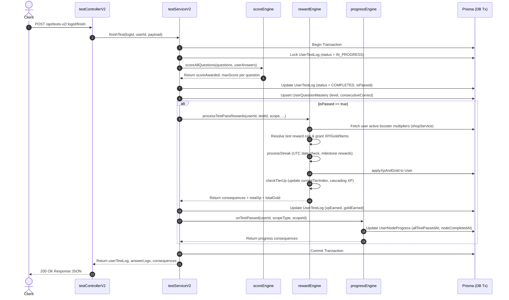

# Test System V2 Documentation

**Current Version:** 2.0  
**Module Location:**
- Backend Routes: [testRoutesV2.ts](../../apps/express-server/src/routes/testRoutesV2.ts)
- Backend Controllers: [testControllerV2.ts](../../apps/express-server/src/controllers/testControllerV2.ts), [contentController.ts](../../apps/express-server/src/controllers/contentController.ts), [authController.ts](../../apps/express-server/src/controllers/authController.ts)
- Backend Services: [testServiceV2.ts](../../apps/express-server/src/services/testServiceV2.ts), [scoreEngine.ts](../../apps/express-server/src/services/scoreEngine.ts), [progressEngine.ts](../../apps/express-server/src/services/progressEngine.ts), [rewardEngine.ts](../../apps/express-server/src/services/rewardEngine.ts), [shopService.ts](../../apps/express-server/src/services/shopService.ts)
- Backend Types: [testV2Types.ts](../../apps/express-server/src/types/testV2Types.ts), [progressTypes.ts](../../apps/express-server/src/types/progressTypes.ts)
- Frontend Feature: [features/test_v2](../../apps/react-native-client/src/features/test_v2)
  - Components: [TestContainer.tsx](../../apps/react-native-client/src/features/test_v2/components/TestContainer.tsx), [TestIntro.tsx](../../apps/react-native-client/src/features/test_v2/components/TestIntro.tsx), [ChooseQuestion.tsx](../../apps/react-native-client/src/features/test_v2/components/ChooseQuestion.tsx), [FillQuestion.tsx](../../apps/react-native-client/src/features/test_v2/components/FillQuestion.tsx), [MatchQuestion.tsx](../../apps/react-native-client/src/features/test_v2/components/MatchQuestion.tsx)
  - Hooks: [useTestRunner.ts](../../apps/react-native-client/src/features/test_v2/hooks/useTestRunner.ts)
  - Services & Store: [testApi.ts](../../apps/react-native-client/src/features/test_v2/services/testApi.ts), [scoreEngine.ts](../../apps/react-native-client/src/features/test_v2/services/scoreEngine.ts), [testHistorySlice.ts](../../apps/react-native-client/src/features/test_v2/store/testHistorySlice.ts)
  - Screens: [TestHistoryScreen.tsx](../../apps/react-native-client/src/features/test_v2/screens/TestHistoryScreen.tsx), [TestDetailScreen.tsx](../../apps/react-native-client/src/features/test_v2/screens/TestDetailScreen.tsx)
- Database Schema: [schema.prisma](../../packages/shared/prisma/schema.prisma)

---

## 1. Feature Overview

The Test System V2 is a unified testing engine supporting both **PRACTICE** (immediate feedback per question, optional retry) and **EXAM** (timed test, nav grid, bulk submission) modes across multiple granular scopes (`GRADE`, `TOPIC`, `LESSON`, `SECTION`, `NODE`, `NATIONAL`).

### Core Design Principles
- **Unified Engine:** Single API surface (`/api/tests-v2/*`) and shared question runner state machine for both exam and practice modes.
- **Dynamic Scope Expansion:** Automated question pool expansion down/up entity hierarchies.
- **Smart Question Selection:** Support for algorithmic auto-picking strategies (`BALANCED`, `LOW_MASTERY`, `WRONG`) alongside manual/curated tests (`testId`).
- **Resumability & Draft Auto-Saving:** Active EXAM sessions auto-save draft responses every 3 seconds (debounced) and can be resumed if unexpired.
- **Client & Server Scoring Parity:** Deterministic grading rules executed on backend upon submission, and locally on frontend during Practice mode for instant sound/mascot feedback.
- **Question Mastery Tracking:** Individual user performance per question (`UserQuestionMastery`) updates level (0-5) and consecutive correct counts upon test finish.
- **Integrated Progress & Gamification Pipeline:** Test passing triggers progress updates (`progressEngine`), calculates XP/Gold/item rewards (`rewardEngine`), updates daily active streaks, and checks tier rank upgrades in a single database transaction.

---

## 2. Architecture & File Structure

```
history-app/
├── apps/express-server/src/
│   ├── controllers/
│   │   ├── authController.ts         # Handles login streak resets
│   │   ├── contentController.ts      # Handles finishStudy node progress triggers
│   │   └── testControllerV2.ts       # HTTP handlers for start, draft, finish, abandon, resumable, history, info
│   ├── routes/
│   │   └── testRoutesV2.ts           # /api/tests-v2 endpoints
│   ├── services/
│   │   ├── progressEngine.ts         # Central engine for progress & node status mutations
│   │   ├── rewardEngine.ts           # Core resolution engine for test rewards, streak milestones, and tier upgrades
│   │   ├── scoreEngine.ts            # Server-side question evaluation & scoring rules
│   │   ├── shopService.ts            # User active booster item effects & multipliers
│   │   └── testServiceV2.ts          # Core service: scope expansion, auto-picking, draft sync, test finish transaction
│   └── types/
│       ├── progressTypes.ts          # ProgressEventType enum & ProgressConsequence payload interfaces
│       └── testV2Types.ts            # DTOs, request/response interfaces, answer data contracts
├── apps/react-native-client/src/features/test_v2/
│   ├── components/
│   │   ├── ChooseQuestion.tsx        # Single / Multi choice UI component
│   │   ├── FillQuestion.tsx          # Text fill-in-the-blank input UI component
│   │   ├── MatchQuestion.tsx         # Pair-matching drag/tap UI component
│   │   ├── PracticeFeedbackMascot.tsx# Mascot feedback view for practice mode
│   │   ├── TestContainer.tsx         # Primary question renderer & layout controller
│   │   └── TestIntro.tsx             # Pre-test preview screen (displays reward previews)
│   ├── hooks/
│   │   └── useTestRunner.ts          # State machine hook managing timer, answers, draft sync, submission
│   ├── screens/
│   │   ├── TestDetailScreen.tsx      # Post-test attempt review with detailed answer breakdown
│   │   └── TestHistoryScreen.tsx     # Past test attempts history listing
│   ├── services/
│   │   ├── scoreEngine.ts            # Client-side local question evaluator for practice mode feedback
│   │   └── testApi.ts                # RTK Query API slice for /api/tests-v2 endpoints
│   ├── store/
│   │   └── testHistorySlice.ts       # Redux slice for history state caching
│   ├── types.ts                      # Frontend TypeScript DTO types
│   └── index.ts                      # Public exports
└── packages/shared/prisma/
    └── schema.prisma                 # UserTestLog, UserAnswerLog, UserNodeProgress, RewardRule, UserRewardLog, Tier, UserItem, ItemDefinition
```

---

## 3. Data Models & Database Schemas

### Main Database Tables

#### `UserTestLog`
Tracks an entire test session (attempt).
- `id` (`String @id @default(uuid())`)
- `userId` (`String`)
- `testId` (`String?`) - NULL for auto-picked tests
- `purposeType` (`PurposeType`: `EXAM` | `PRACTICE`)
- `status` (`TestStatusType`: `IN_PROGRESS` | `COMPLETED` | `EXPIRED` | `ABANDONED`)
- `score` (`Int`) - Percentage score (0-100)
- `scoreAwarded` (`Float`), `maxScore` (`Float`)
- `xpEarned` (`Int`), `goldEarned` (`Int`) - Test-specific rewards earned upon passing
- `isPassed` (`Boolean?`)
- `startedAt`, `submittedAt`, `expiresAt` (`DateTime?`)
- `attemptNumber` (`Int`)
- `questionCount` (`Int`), `passThreshold` (`Int`), `timeLimit` (`Int?`)
- `scopeType` (`ScopeType?`), `scopeId` (`Int?`)
- `questionSequenceJson` (`Json`) - Array of `questionId` integers specifying test question order
- `draftAnswerJson` (`Json`) - Array of `DraftAnswerEntry` objects auto-saved in progress
- `autoPickStrategy` (`AutoPickStrategy?`: `BALANCED` | `LOW_MASTERY` | `WRONG`)

#### `UserAnswerLog`
Stores final graded answer record per question when a test is finished.
- `id` (`String @id`)
- `userTestLogId` (`String`)
- `questionId` (`Int`)
- `type` (`QuestionType`: `CHOOSE` | `FILL` | `MATCH`)
- `answerDataJson` (`Json`) - User submitted response
- `scoreAwarded` (`Float`), `maxScore` (`Float`)
- `answeredAt` (`DateTime`)

#### `Question`
- `id` (`Int @id @default(autoincrement())`)
- `type` (`QuestionType`)
- `difficulty` (`Int`) - 1 to 4
- `promptText` (`String`), `document` (`String?`), `explanation` (`String?`)
- `answerDataJson` (`Json`) - Contains correct options, accepted text strings, or pair matches
- `scopeType` (`ScopeType?`), `scopeId` (`Int?`)
- `isActive` (`Boolean`)

#### `UserQuestionMastery`
Tracks user mastery per question across attempts.
- `userId` (`String`), `questionId` (`Int`) (Composite key)
- `level` (`Int`) - 0 to 5
- `consecutiveCorrect` (`Int`)

#### `UserNodeProgress`
Tracks student progression on specific study nodes.
- `userId` (`String`), `nodeId` (`Int`) (Composite key)
- `studiedAt` (`DateTime?`) - Timestamp when user finished reading/watching node content
- `allTestPassedAt` (`DateTime?`) - Timestamp when user passed tests scoped to this node
- `nodeCompletedAt` (`DateTime?`) - Timestamp when node was marked complete

#### `User` (Gamification & Streak Fields)
- `totalXp` (`Int @default(0)`) - Total cumulative experience points
- `totalGold` (`Int @default(0)`) - Spendable currency total
- `currentStreak` (`Int @default(0)`) - Active consecutive daily activity streak count
- `highestStreak` (`Int @default(0)`) - All-time maximum streak record
- `lastTestPassedAt` (`DateTime?`) - UTC timestamp of the user's most recent passed test
- `currentTierIndex` (`Int @default(1)`) - Current rank index in the Tier hierarchy

#### `RewardRule`
Configurable rules for granting XP, Gold, and inventory items upon triggers.
- `id` (`Int @id @default(autoincrement())`)
- `triggerType` (`RewardTriggerType`)
- `triggerTargetId` (`String?`) - Specific entity ID (e.g. testId, tier index, streak count), or NULL for global fallback
- `triggerTimeMin` (`Int`) - Minimum attempt count to apply rule
- `triggerTimeMax` (`Int?`) - Maximum attempt count (NULL = unbounded)
- `xp` (`Int`), `gold` (`Int`)

#### `UserRewardLog`
Audit log of granted rewards to ensure idempotency.
- `id` (`Int @id @default(autoincrement())`)
- `userId` (`String`), `rewardRuleId` (`Int`), `userTestLogId` (`String?`)
- `triggerType` (`RewardTriggerType`), `triggerTargetId` (`String?`), `triggerTime` (`Int`)
- `xpAwarded` (`Int`), `goldAwarded` (`Int`)
- Unique Constraint: `[userId, rewardRuleId, triggerTargetId, triggerTime]`

#### `Tier`
Rank levels based on cumulative XP thresholds.
- `index` (`Int @id`) - Level index (1, 2, 3, ...)
- `name` (`String`) - Tier title (e.g. "Tân binh", "Học sĩ")
- `badgeImgUrl` (`String?`)
- `xpThreshold` (`Int`) - Minimum `totalXp` required to reach tier

---

## 4. Question Types & Answer Data Contracts

### 1. CHOOSE (`QuestionType = "CHOOSE"`)
- **Question Correct Data (`Question.answerDataJson`):**
  ```json
  {
    "options": ["Option A", "Option B", "Option C", "Option D"],
    "correctOption": [0]
  }
  ```
- **User Draft/Answer Data (`UserChooseAnswer`):**
  ```json
  {
    "selectedOptions": [0]
  }
  ```

### 2. FILL (`QuestionType = "FILL"`)
- **Question Correct Data (`Question.answerDataJson`):**
  ```json
  {
    "acceptedAnswers": ["Ngo Quyen", "Ngô Quyền"]
  }
  ```
- **User Draft/Answer Data (`UserFillAnswer`):**
  ```json
  {
    "typedAnswer": "ngo quyen"
  }
  ```

### 3. MATCH (`QuestionType = "MATCH"`)
- **Question Correct Data (`Question.answerDataJson`):**
  ```json
  {
    "pairs": [
      { "left": "938", "right": "Bạch Đằng" },
      { "1077", "right": "Như Nguyệt" }
    ]
  }
  ```
- **User Draft/Answer Data (`UserMatchAnswer`):**
  ```json
  {
    "pairs": [
      { "left": "938", "right": "Bạch Đằng" }
    ]
  }
  ```

---

## 5. Backend Core Logic

### Scope Expansion (`expandScopeToQuestionWhere`)
Recursively expands parent scopes to include all child entity question pools:
- `NODE`: `scopeType = NODE AND scopeId = :id`
- `SECTION`: Includes section questions + child section questions + node questions under those sections.
- `LESSON`: Includes lesson questions + all root & nested section questions + node questions.
- `TOPIC`: Includes topic questions + lesson questions + section questions + node questions.
- `GRADE`: Includes grade questions + topic questions + lesson questions + section questions + node questions.
- `NATIONAL`: `scopeType = NATIONAL`

### Auto-Picking Strategies (`autoPickQuestions`)
1. `BALANCED` (Default):
   - Fetches questions directly under target scope.
   - If more questions are required, allocates targets to child scopes using a square-root weighted distribution formula (`w = sqrt(pool_size)`).
   - Falls back to global question pool if target count is not reached.
2. `LOW_MASTERY`:
   - Prioritizes questions with `UserQuestionMastery.level <= 2` (80% target ratio).
   - Fills remaining 20% from questions with `level >= 3`.
3. `WRONG`:
   - Prioritizes questions with `UserQuestionMastery.consecutiveCorrect == 0` (80% target ratio).
   - Fills remaining 20% from questions with `consecutiveCorrect >= 1`.

### Presets & Configuration Hierarchy
When starting a test, parameters (`questionCount`, `passThreshold`, `timeLimit`, `difficultyRatioJson`) resolve in order:
1. Direct Request overrides (`req.body`)
2. Specific Test object configuration (if `testId` provided)
3. Matched `TestPreset` (or `ScopeTestPresetDefault`)
4. Default fallback values (`questionCount = 10`, `passThreshold = 80`, `timeLimit = 15` for EXAM / `null` for PRACTICE)

### Scoring Engine Logic (`scoreEngine.ts`)
- **CHOOSE:**
  - Single Choice (`correctOption.length <= 1`): `maxScore = 0.25`. Awarded full `0.25` if exact single option matches.
  - Multi Choice: `maxScore = Math.max(0.25, Math.floor(options.length / 2) * 0.25)`. Correct selections earn `maxScore / correctCount`; incorrect selections deduct `maxScore / incorrectCount`. Score clamped to `>= 0`.
- **FILL:**
  - `maxScore = 0.5`.
  - Normalizes text (lowercase, punctuation stripped, whitespace collapsed).
  - Exact match on extracted digits required.
  - Evaluates string similarity using Levenshtein distance: allowed typos scale with word count (1 word: 0 typos, 2 words: 1 typo, 3-5 words: 2 typos, >=6 words: 3 typos).
- **MATCH:**
  - `maxScore = Math.max(0.25, Math.floor(pairs.length / 2) * 0.25)`.
  - Full `maxScore` awarded if all left-right pairs match correctly; otherwise `0`.

---

## 6. Progress Engine, Rewards, Tiers & Streak System

### 6.1 Progress Engine (`progressEngine.ts`)
The `ProgressEngine` handles student progression state transitions, tracking node study events and node test completions.

#### Key Methods & Lifecycle
- `finishStudy(nodeId, userId)`:
  - Invoked by `contentController` when user views a study node.
  - Upserts `UserNodeProgress` with `studiedAt = now()`.
  - Checks `nodeHasRelevantQuestions(nodeId)`: if the node has **no associated questions**, studying auto-completes the node (`nodeCompletedAt = now()`) and triggers `handleNodeCompletion`.
- `onTestPassed(userId, scopeType, scopeId, testTitle, tx)`:
  - Invoked during `finishTest` transaction when a test attempt passes (`isPassed = true`).
  - Appends `ProgressEventType.TEST_PASSED` consequence message.
  - If `scopeType === "NODE"`: updates `UserNodeProgress.allTestPassedAt = now()`.
  - If node is not yet completed (`nodeCompletedAt == null`), updates `nodeCompletedAt = now()` and invokes `handleNodeCompletion`.
- `onTestCompleted(userId, scopeType, scopeId, attemptNumber, isPassed, testTitle, tx)`:
  - Entry point called by `testServiceV2.ts` on attempt finish. Formats ordinal attempt messages ("1st", "2nd", "3rd", etc.) and delegates to `onTestPassed` if passed.
- `handleNodeCompletion(userId, nodeId, tx)`:
  - Emits `ProgressEventType.NODE_COMPLETED` consequence. Standard extension hook for future node-completion bonuses.

#### Consequence Event System (`ProgressConsequence`)
Every progress mutation returns a list of standardized consequence objects passed to the client UI:
```ts
export enum ProgressEventType {
    NODE_COMPLETED = "NODE_COMPLETED",
    TIER_GAINED = "TIER_GAINED",
    STREAK_MILESTONE = "STREAK_MILESTONE",
    STREAK_UPDATED = "STREAK_UPDATED",
    TEST_PASSED = "TEST_PASSED",
    REWARD_EARNED = "REWARD_EARNED",
}

export interface ProgressConsequence {
    eventType: ProgressEventType;
    message: string;
    xpGained?: number;
    goldGained?: number;
    itemsGained?: { name: string; imgUrl: string | null; quantity: number }[];
    payload?: Record<string, any>;
}
```

---

### 6.2 Reward Engine (`rewardEngine.ts`)
The `RewardEngine` resolves, calculates, and grants XP, Gold, inventory items, streaks, and tier updates.

#### 1. Trigger Determination (`determineTrigger`)
Maps test parameters into a `RewardTriggerType` and target ID:
- Manual test (`testId` present) $\rightarrow$ `MANUAL_TEST_COMPLETE` with `triggerTargetId = testId`.
- Practice `WRONG` auto-pick $\rightarrow$ `AUTO_WRONG_PRACTICE_COMPLETE`.
- Practice `LOW_MASTERY` auto-pick $\rightarrow$ `AUTO_PERSONAL_PRACTICE_COMPLETE`.
- Scope auto-pick (`NODE`, `SECTION`, `LESSON`, `TOPIC`, `GRADE`) $\rightarrow$ `AUTO_[SCOPE]_TEST_COMPLETE` with `triggerTargetId = scopeId`.

#### 2. Reward Rule Resolution (`resolveReward`)
1. Calculates `triggerTime` by counting previous `UserRewardLog` entries for `(userId, triggerType, triggerTargetId)`.
2. Searches `RewardRule` table with priority:
   - **Exact Match:** `triggerType = :triggerType AND triggerTargetId = :triggerTargetId AND triggerTimeMin <= :triggerTime <= triggerTimeMax`.
   - **Fallback Match:** `triggerType = :triggerType AND triggerTargetId = NULL AND triggerTimeMin <= :triggerTime <= triggerTimeMax`.
   - **Practice Exception:** Practice triggers (`AUTO_WRONG_PRACTICE_COMPLETE`, `AUTO_PERSONAL_PRACTICE_COMPLETE`) ignore `triggerTime` bounds and match the latest active rule.
   - **Hardcoded Fallbacks:** If no `RewardRule` is defined in DB:
     - Standard Test: `10 XP`, `5 Gold` base (`DEFAULT_TEST_REWARD`).
     - Practice Test: `1 XP`, `1 Gold` per question (`DEFAULT_PER_QUESTION_REWARD * questionCount`).

#### 3. Active Boosters & Multipliers (`shopService.getUserActiveEffects`)
- Reads user active items/cards from `UserActiveEffect`.
- Calculates active `xpMultiplier` (e.g. 1.5x) and `goldMultiplier` (e.g. 2.0x).
- Applied to base test rewards, streak rewards, and tier rewards.

#### 4. Reward Granting & Idempotency (`grantReward`)
- Checks `UserRewardLog` for existing entry matching `[userId, rewardRuleId, triggerTargetId, triggerTime]`.
- If already granted, returns 0 awarded to prevent double-dipping.
- Item Rewards: Updates `UserItem`. Caps single-stack items (`SKIN`, `BADGE`) at max quantity `1`.

#### 5. Pre-Test Reward Preview (`previewTestReward`)
- Called by `/api/tests-v2/info` endpoint to display potential rewards on `TestIntro` screen before student starts test.
- Computes expected XP, Gold, active multipliers, and potential item drops without modifying database state.

---

### 6.3 Streak Tracking & Reset Engine

#### Core Attributes (`User` model)
- `currentStreak`: Current active consecutive daily streak count.
- `highestStreak`: Historical peak streak count.
- `lastTestPassedAt`: Timestamp of the last passed test.

#### Daily Streak Calculation (`processStreak`)
Evaluated inside the test finish transaction when a test is passed:
1. Calculates UTC date string (`YYYY-MM-DD`) for `lastTestPassedAt`, `todayUtc()`, and `yesterdayUtc()`.
2. **Same Day Pass (`lastPassDate === todayUtc()`):** Streak already updated today. Preserves current streak.
3. **Consecutive Day Pass (`lastPassDate === yesterdayUtc()`):** Increments streak: `newStreak = currentStreak + 1`. Updates `highestStreak = max(newStreak, highestStreak)`.
4. **Broken Streak (`lastPassDate < yesterdayUtc()` or `null`):** Resets active streak: `newStreak = 1`.
5. Updates `User` record with `currentStreak`, `highestStreak`, and `lastTestPassedAt = now()`.
6. Emits `STREAK_UPDATED` consequence.

#### Streak Milestone Rewards
- Resolves `RewardTriggerType.STREAK_REACHED` for `triggerTargetId = String(newStreak)`.
- If a matching `RewardRule` exists, grants XP, Gold, and inventory items, emitting a `STREAK_MILESTONE` consequence.

#### Login Reset Mechanism (`checkStreakOnLogin`)
- Triggered during user authentication (`authController`).
- If `lastTestPassedAt` is older than `yesterdayUtc()`, automatically resets `currentStreak = 0` in database.

---

### 6.4 Tier Progression & Cascading Upgrades

#### Core Structure (`Tier` model)
Tiers are defined in DB with an `index` integer (1-indexed), `name`, `badgeImgUrl`, and required `xpThreshold`.

#### Tier Upgrade Pipeline (`checkTierUp`)
Evaluated whenever XP is granted:
1. Reads `user.totalXp` and `user.currentTierIndex`.
2. Finds the highest tier rank where `xpThreshold <= totalXp` and `index > currentTierIndex`.
3. If qualified:
   - Updates `user.currentTierIndex = nextTier.index`.
   - Emits `TIER_GAINED` consequence with tier name, badge image, and payload details.
   - **Tier Reward Resolution:** Resolves `RewardTriggerType.TIER_REACHED` for `triggerTargetId = String(nextTier.index)`.
   - **Cascading Multi-Level Upgrades:** If the tier reward grants additional XP, it is applied immediately (`applyXpAndGold`) and the check loops (`while keepChecking`) to handle multiple tier rank-ups in a single transaction.

---

### 6.5 End-to-End Test Finish Pipeline

When `/api/tests-v2/:logId/finish` is called, execution flows through the following transactional steps in `testServiceV2.ts`:



---

### 6.6 Extension & Upgrade Entry Points

To upgrade or modify progress, rewards, streaks, or tiers, refer to these primary entry points:

1. **Adding New Progress Consequences / Node Logic:**
   - Modify `handleNodeCompletion` or add event types in [progressEngine.ts](../../apps/express-server/src/services/progressEngine.ts) and [progressTypes.ts](../../apps/express-server/src/types/progressTypes.ts).
2. **Modifying Reward Formulas or Triggers:**
   - Adjust `determineTrigger` or `resolveReward` in [rewardEngine.ts](../../apps/express-server/src/services/rewardEngine.ts).
   - Configure rules in the `RewardRule` table via Admin portal or Prisma seeds.
3. **Changing Streak Rules (e.g. Streak Freeze, Timezone handling):**
   - Update date comparison logic in `processStreak` and `checkStreakOnLogin` in [rewardEngine.ts](../../apps/express-server/src/services/rewardEngine.ts).
4. **Adding New Tier Levels or Badges:**
   - Insert rows into `Tier` table in DB with `index`, `name`, `xpThreshold`, and `badgeImgUrl`. `checkTierUp` dynamically scales with DB rows.
5. **Item Boosters & Multipliers:**
   - Add new consumable/booster item types in `shopService.ts` and handle active effect calculation in `getUserActiveEffects`.

---

## 7. Frontend Execution & Component Architecture

### `useTestRunner` Custom Hook State Machine
Manages test execution lifecycle across states:
- `idle`: Not started / inactive.
- `loading`: Requesting `/start` or `/resumable`.
- `running`: Active session in progress.
- `submitting`: Sending `/finish` request.
- `completed`: Test finished, showing result view.

#### Key Mechanics:
- **Timer (EXAM Mode):** Calculates remaining time based on `session.expiresAt`. Auto-submits test when time reaches 0.
- **Draft Auto-Sync:** Debounces draft answers sync to backend (`PUT /api/tests-v2/:logId/draft`) every 3 seconds.
- **Practice Local Evaluation:** Invokes local `evaluateQuestion` on `confirmAnswer` to play correct/wrong audio feedback without network latency.
- **Redo Wrong (PRACTICE Mode):** `redoWrong()` filters question sequence to only incorrectly answered questions and resets local draft/eval state for another attempt.
- **Consequence Handling:** On test completion response, receives `consequences` array to trigger reward dialogs, streak bump modals, tier-up animations, or node complete banners.

### Component Structure
- `TestContainer`: Root container hosting navigation header, progress indicator, question component switcher, bottom action toolbar, and question drawer grid.
- `TestIntro`: Displays test parameters, rewards preview (`previewTestReward`), and "Start Test" trigger.
- `ChooseQuestion`: Render component for single/multi choice options.
- `FillQuestion`: Render component for text entry with keyboard handling.
- `MatchQuestion`: Render component for interactive pair matching.
- `PracticeFeedbackMascot`: Animated mascot displaying immediate correctness feedback in Practice mode.

---

## 8. API Endpoints Reference

| Endpoint | Method | Middleware | Request Body / Query | Description |
| :--- | :--- | :--- | :--- | :--- |
| `/api/tests-v2/resumable` | GET | `requireStudent` | None | Returns active unexpired EXAM session if any; abandons stale practice sessions. |
| `/api/tests-v2/info` | POST | `requireStudent` | `StartTestV2Request` | Fetches test metadata, question count, time limit, and reward preview (`xp`, `gold`, `items`) before starting. |
| `/api/tests-v2/start` | POST | `requireStudent` | `StartTestV2Request` | Initializes a new test log attempt and returns question sequence + DTOs. |
| `/api/tests-v2/:logId/draft` | PUT | `requireStudent` | `{ draftAnswerJson: DraftAnswerEntry[] }` | Auto-saves student draft answer state. |
| `/api/tests-v2/:logId/finish` | POST | `requireStudent` | `{ draftAnswerJson, seenQuestionIds }` | Grades submitted answers, updates user mastery, executes reward engine, streak, tier, and progress engine transaction, returning `consequences`. |
| `/api/tests-v2/:logId/abandon`| POST | `requireStudent` | None | Marks an active test log status as `ABANDONED`. |
| `/api/tests-v2/history` | GET | `requireStudent` | `scopeType`, `scopeId`, `testId` | Returns past test attempt logs. |
| `/api/tests-v2/history/:logId`| GET | `requireStudent` | None | Returns detailed question breakdown and user answers for a past attempt. |
| `/api/tests-v2/national` | GET | `optionalAuth` | None | Returns list of available National tests. |
| `/api/tests-v2/practice-stats`| GET | `requireStudent` | `scopeType`, `scopeId` | Returns summary count of wrong and answered questions for practice mode. |
